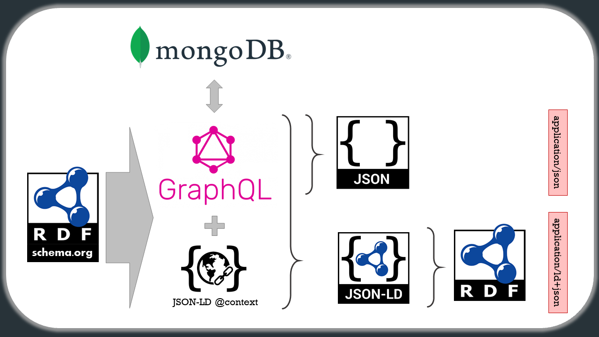

  

# Staple API

Staple API is a GraphQL-based API for managing **structured data** (i.e., linked data expressed within the [schema.org data model](https://schema.org/docs/datamodel.html)). This repository provides the documentation of the current state of the API and its functionalities. 

**Note (!)**: *This project is at very early stages of development*

## Playground

The live Staple API playground is available at: [http://staple-api.org](http://staple-api.org).

## Contact

For open technical issues and inquiries feel free to create a GitHub issue in this repository. All questions can also be sent to [staple-api@epistemik.co](staple-api@epistemik.co).

## Overview

  

Staple API is a GraphQL-based application programming interface written in NodeJS for managing structured data, i.e., linked data expressed within the [schema.org data model](https://schema.org/docs/datamodel.html). The current key features include:

1. Automatic generation of GraphQL schema from an RDF ontology (expressed using the schema.org data model).
2. Automatic generation of resolvers for all queries and mutations present in the schema.
3. Exposure of JSON-LD context enabling immediate mapping of API responses to JSON-LD objects. 
3. Default in-memory graph storage for managing structured data. 

## Technologies used

* [GraphQL](https://graphql.org/)
* [Apollo Server](https://www.apollographql.com/)
* [schema.org](http://schema.org)
* [JSON-LD](https://json-ld.org)
* [Graphy](https://graphy.link/)
* [NodeJS](https://nodejs.org)

## Documentation topics
* [Ontology and schema](schema/)
* [Data](data/)
* [Queries](query/)
* [Inference & inheritance](inference/)
* [Mutations](mutations/) 
