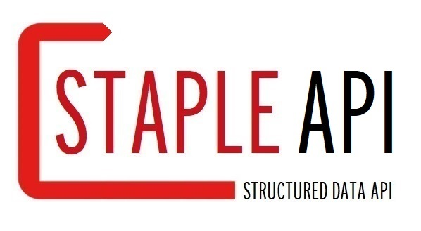

<!-- _coverpage.md -->

<!-- # Staple API <small>0.1</small> -->

> Semantic knowledge graph app in 15 min

- GraphQL-API for managing semantic knowledge graphs
- MongoDB back-end
- under-the-hood JSON-LD conversions between JSONs and linked data

[GitHub](https://github.com/epistemik-co/staple-api)
[Documentation](/home/)
[Playground](http://staple-api.org)